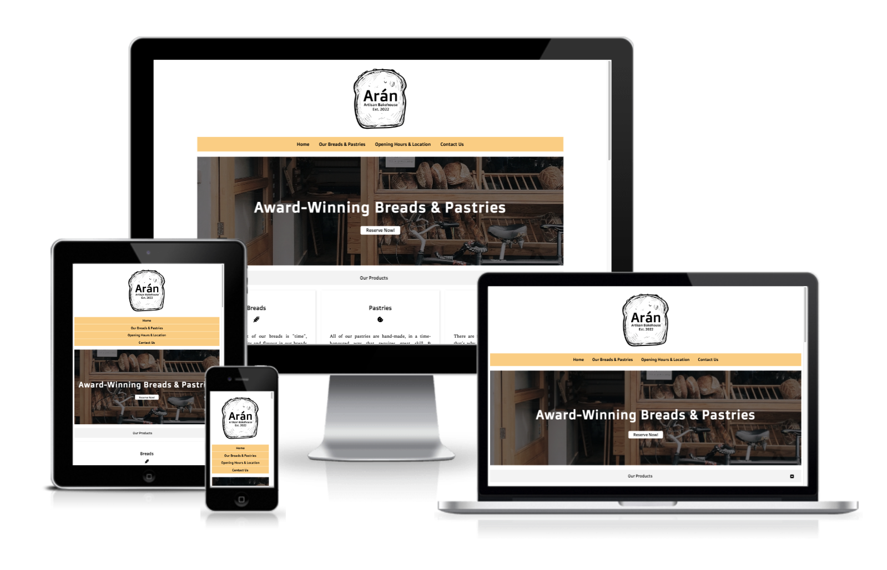
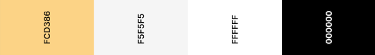
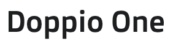
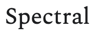

# **Arán Bakehouse**
## **Description**
This is a website for a fictional bakery, located in Doolin, Co. Clare which was built as part of the Code Institute's Full Stack Developer Course. The website is primarly designed to provide the visitor with information on the business such as its offerings, location, opening hours and contact details. 

The site is readily accessible on a variety of devices and behaves in a responsive manner, accomodating all screen sizes in a way that maintains a useable and enjoyable interface.

It was designed with plain HTML and CSS only: I wanted to avoid using Javascript or even CSS libraries as I felt that a design that was coded from the bottom up would be more useful in terms of the learning experience. I did make use of a small number of technologies such as the Google Maps API, as well as Google Fonts and Fontawesome, which I felt were acceptable enough to use while still keeping the design as 'vanilla' as possible.

The live page can be found here: LINK

 

 

# **Development**
The project was developed using HTML and CCS as the primary languages and an emphasis was placed on good UX design and best practice.

## **Users and Target Audience**

### **Target Audience**
The target audience is made up of both locals and visitors to the area who would like to find out if there was a place to pick up some bread, a pastry or a nice coffee. The area is quite 'touristy', with people coming to Doolin as part of a trip to the Aran Islands or a visit to the Cliffs of Moher. As the bakery is small and located off the main road, it may be easily missed, so a good online presence is essential.

### **User Stories**
- A **New User** wants to be able to find the website on Google in the first place, so good SEO and valid code are important. Such as user wants to see easy-to-find information on offerings, location, opening hours and contact information. In the case of a person with certain disabilities, this person still wants to be able to use the site - perhaps with the help of assistive technologies - so this has to be considered.

- An **Existing User** wants to be able to return to the website and quickly be able to see if any information has changed, or quickly navigate to a section they have been to before but have forgotten the information within, e.g. opening hours, telephone number. Additionally, a previous user may wish to use the contact form to contact the business. 

- An **Admin User** wants to be able to add new content without worrying that the layout might break. They also want to be able to navigate the source code with only basic knowledge of such and be able to change content-relevant code, e.g. opening hours. Well-structured, easy-to-read code with appropriate commentary is helpful in this regard.

## **Design & Structure**

### **Color Scheme**
The colour scheme was kept very simple and clean, with a lot of white `(#FFFFFF)`, a shade of orange `(#FCD386)` as well as a light grey `(#F5F5F5)`. Additionally, for e.g. hover effects, the `opacity` attribute was used to style elements. The main text is rendered as black on white. Overall, the site provides good contrast and viewing experience.

### **Layout**
The layout was kept clean and free of clutter, using a one-page design: main sections are seperated by a header bar and sub-sections are kept visually seperated using a grid-based card design.
### **Fonts**
The main fonts used were provided by Google Fonts, and are named `Doppio One` and `Spectral`. The former was used in the main logo and for the headers while the `Spectral` font was used for the text content. I felt these complemented each other very well and made it easy to distinguish heading- and body text. Back-up fonts of `sans-serif` and `serif` were used respectively, in line with the type of preferred font. 

 

### **Images**
Images used were procured from `Pexels.com` and were resized according to requirements. They were also converted to `.webp` format in an effort to ensure quality, size and loading performance. Colour tone was adjusted to preference using a mixture of `opacity` attributes and gradient overlays. Images were rounded using the `border-radius` attribute, which worked very well. Lastly, a favicon was added to the page: this was constructed from part of the logo design elements and re-sized accordingly.
### **Logo**
I designed the main logo specifically for the page using Procreate. I isolated the main drawing from a licence-free artwork and added text to it before converting it to an appropriately-size `.webp` file. 

