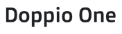
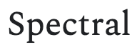

# **Arán Bakehouse**
## **Description**
This is a website for a fictional bakery, located in Doolin, Co. Clare which was built as part of the Code Institute's Full Stack Developer Course. The website is primarly designed to provide the visitor with information on the business such as its offerings, location, opening hours and contact details. 

The site is readily accessible on a variety of devices and behaves in a responsive manner, accomodating all screen sizes in a way that maintains a useable and enjoyable interface.

It was designed with plain HTML and CSS only: I wanted to avoid using Javascript or even CSS libraries as I felt that a design that was coded from the bottom up would be more useful in terms of the learning experience. I did make use of a small number of technologies such as the Google Maps API, as well as Google Fonts and Fontawesome, which I felt were acceptable enough to use while still keeping the design as 'vanilla' as possible.

The live page can be found here: [Arán Bakehouse](https://tomh-22.github.io/Milestone-Project-1/)

 

 

# **Development**
The project was developed using HTML and CCS as the primary languages and an emphasis was placed on good UX design and best practice.

## **Users and Target Audience**

### **Target Audience**
The target audience is made up of both locals and visitors to the area who would like to find out if there was a place to pick up some bread, a pastry or a nice coffee. The area is quite 'touristy', with people coming to Doolin as part of a trip to the Aran Islands or a visit to the Cliffs of Moher. As the bakery is small and located off the main road, it may be easily missed, so a good online presence is essential.

### **User Stories**
- A **New User** wants to be able to find the website on Google in the first place, so good SEO and valid code are important. Such as user wants to see easy-to-find information on offerings, location, opening hours and contact information. In the case of a person with certain disabilities, this person still wants to be able to use the site - perhaps with the help of assistive technologies - so this has to be considered.

- An **Existing User** wants to be able to return to the website and quickly be able to see if any information has changed, or quickly navigate to a section they have been to before but have forgotten the information within, e.g. opening hours, telephone number. Additionally, a previous user may wish to use the contact form to contact the business. 

- An **Admin User** wants to be able to add new content without worrying that the layout might break. They also want to be able to navigate the source code with only basic knowledge of such and be able to change content-relevant code, e.g. opening hours. Well-structured, easy-to-read code with appropriate commentary is helpful in this regard.

## **Design & Structure**

### **Color Scheme**
The colour scheme was kept very simple and clean, with a lot of white `(#FFFFFF)`, a shade of orange `(#FCD386)` as well as a light grey `(#F5F5F5)`. Additionally, for e.g. hover effects, the `opacity` attribute was used to style elements. The main text is rendered as black on white. Overall, the site provides good contrast and viewing experience.

### **Layout**
The layout was kept clean and free of clutter, using a one-page design: main sections are seperated by a header bar and sub-sections are kept visually seperated using a grid-based card design.
### **Fonts**
The main fonts used were provided by Google Fonts, and are named `Doppio One` and `Spectral`. The former was used in the main logo and for the headers while the `Spectral` font was used for the text content. I felt these complemented each other very well and made it easy to distinguish heading- and body text. Back-up fonts of `sans-serif` and `serif` were used respectively, in line with the type of preferred font. 

 

### **Images**
Images used were procured from `Pexels.com` and were resized according to requirements. They were also converted to `.webp` format in an effort to ensure quality, size and loading performance. Colour tone was adjusted to preference using a mixture of `opacity` attributes and gradient overlays. Images were rounded using the `border-radius` attribute, which worked very well. Lastly, a favicon was added to the page: this was constructed from part of the logo design elements and re-sized accordingly.
### **Logo**
I designed the main logo specifically for the page using Procreate. I isolated the main drawing from a licence-free artwork and added text to it before converting it to an appropriately-size `.webp` file.

## **Features**

### **Logo**
The main logo is positioned at the top of the page and illustrates the branding of the business. Its design was discussed above. 
### **Navigation Bar**
The navigation bar is static, and while I would have preferred it to be 'sticky', this did not fit within the scope of the project and was not really required given the amount of content within the site. It is laid out in such a way as to direct the user to the most important sections right away, as per user experience design requirements. 
### **Splash Image with Promo Text**
The splash image provides visual appeal to the user and provides a way to showcase aspects of the business. It contains a promotional message overlay that can be amended to suit, as well as a button style link that can perform a suitable action. In this case it brings the user to the 'contact' section.
### **Product Highlights Section**
This consists of three 'cards', highlighting some of the business' key products. The layout can be changed in that columns could easily be added or removed depending on requirements. All sections are based on a `display: grid;` layout.
### **Google Map**
The Google map was added to illustrate the business' location and provide interesting content. It was sized and styled in accordance with the site's overall design. I experimented with various map styles and settled on a monotone style which I implemented using a `greyscale` style attribute. 
### **Table with Opening Hours**
I utilised a table element to display the bakery's opening hours. This makes the formating consistent and the content easy to amend. I achieved seperation of the table header containing the days of the week from the table data containing the hours by adding an empty `td` element with a `width: 50px` attribute. 
### **Contact Form**
The contact form is similar to the one that we used during the 'Love Running' code along and captures simple data: name, email address and a message. I applied custom styling, in line with rest of th page, and made sure that a requirement to complete all fields was added. I omitted any newsletter sign-up options as I felt it was not required here. I used the Code Institute's default form post method, and submitting the form results in a new tab being opened which displays a success message. Ideally, I would have liked to add additional functionality to the form but I felt this would require Javascript.
### **Social Media Links**
I added social media links to the 'contact' section of the page: I made use of Fontawesome icons which I styled with a `:hover` attribute. All external links open in a new tab which is also stated in the `aria-label`. 
### **Footer**
The footer contains some copyright info and a short funny message. It is styled similarly to the section headers but a seperate class to style the text content. 
### **Arrow Icon**
Every section header, as well as the footer, incorporates a small arrow icon which, when clicked, will bring the user back to the top of the page. On hover, a 'Back to Top!' message is displayed.

## **Testing, Validation and Compatibility**

### **HTML Validation**
The HTML code was assessed using the W3C Mark-Up Validator Tool. While I did encounter some syntax errors, all were fixed prior to deployment. 
### **CSS Validation**
The HTML code was assessed using the W3C CSS Validator Tool. Again, while I did encounter some syntax errors, all were fixed prior to deployment. 
### **Lighthouse Testing**
Assessing the site based on performance, accessibility, best practices and SEO using Chrome Developer Tools' Lighthouse test highlighted a number of issues which prompted me to make a number of changes prior to deployment:
- I addressed accessibility issues by adding relevant attributes to some elements, i.e. `aria-label`, `title`, `alt` text and such. 
- I addressed performance issues by reducing image file sizes and re-uploading them in a `.webp` format. Additionally, I added fall-back fonts and added additional code to improve initial page load speed. 
- I addressed a few other minor issues as recommended by the report to bring the overall score up into the green area. 
A number of issues highlighted were as a result of third-party code, such as the Google Maps API, Google Fonts and the Fontawesome script but I did not address these.  
### **Cross-browser Checks and Device Testing**
I tested the site on a variety of browsers: Edge, Opera, Safari, Firefox and Chrome. All rendered the site as expected. I also tested the site on Chrome and Safari within iOS - this presented no problems. 

I added a media query feature which alters the layout of the page once the `vw` become less than `800px` to a format more suitable for mobile devices. These design changes work well up to a `vw` of `315px` at which point the layout becomes constrained. I could have added more styles as part of a further media query but decided against it as even a small mobile device offers a screen width of at least 320px nowadays. 
### **Links**
All links were checked and worked as expected. All external links opened in a new tab. 
### **Contact Form**
The contact form was checked and worked as expected. The field validation worked also.